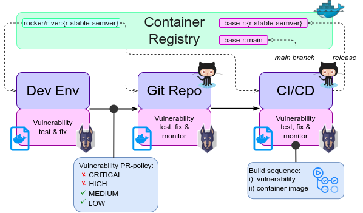
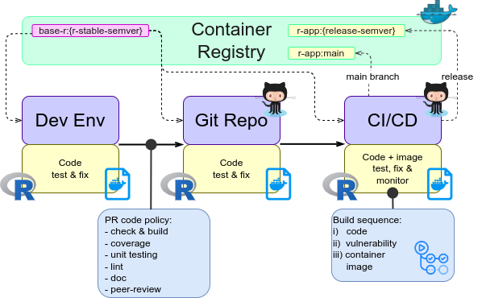

```{r, include = FALSE}
knitr::opts_chunk$set(
  collapse = TRUE,
  comment = "#>"
)
```

## Short introduction
Since 2019 [Rapporteket](https://rapporteket.github.io/rapporteket/) has been provided as shiny applications hosted by [shiny-server](https://www.rstudio.com/products/shiny/shiny-server/). From 2023 on, application will be migrated to standalone container application based on the [Docker platform](https://www.docker.com/) and hosted in a [kubernetes](https://kubernetes.io/) cluster. This document proposes methods that aim to provide an agile and robust process from development to deployment throughout the lifecycle. As such, this document is also meant to be a primer for discussions on further improvements and refinements.

## Container content
In this set-up, each registry will be represented as a standalone container application at Rapporteket, _i.e._ deployment will be based on registry speciffic container images. However, registries at Rapporteket all share a common set of features such as system environment and underlying software (_e.g._ [R](https://cran.r-project.org/)). These will all be established as a base container image the all registry speciffic container images are build upon. Both types of container images are described below. 

### Base container image
This image is based on [Ubuntu LTS](https://releases.ubuntu.com/), common system libraries, [R-release](https://cran.r-project.org/sources.html) and common [R-packages](https://en.wikipedia.org/wiki/R_package). Relevant system locale setting are also defined in this image. The outset is provided by [rocker/r-verse](https://github.com/rocker-org/rocker-versioned2/blob/master/README.md) that keeps track of whatever applies to Ubuntu LTS and R-stable. Specification for building the base image is provided by the [corresponding Dockerfile](https://github.com/Rapporteket/base-r/blob/main/Dockerfile).

### Application container image
Registry speciffic [R-shiny applications](https://shiny.rstudio.com/) are added ontop of the [base image](https://github.com/Rapporteket/base-r). Source code management for each registry application happens under the [Rapportkeet organization at GitHub](https://github.com/Rapporteket/) where the respective Dockerfiles for building these images also resides.

## Pipeline for continuous integration and delivery (CI/CD)
To ensure that changes to Rapporteket can be delivered in a timely and reliable manner specific workflows are adopted. These pipelines for both the base image and registry applications are illustrated below.





## CI/CD tools and methods
Vulnerability test and monitoring of container images is performed by [snyk](https://snyk.io/). The base container image is monitored by weekly scans to detect emerging threats and changes to underlying code is also scanned as part of all [pull requests](https://www.pagerduty.com/resources/learn/what-is-a-pull-request/) to prevent new vulnerabilities from entering the main project. Currently, vulnerabilities with low or medium severity are accepted, high and critical are not.

As all code repositories are managed at GitHub, [Github Actions](https://docs.github.com/en/actions) are used to implement the CI/CD policy and are triggered both on a schedule and on code update requests.

## Deployment
_TBD NHN private cloud services TBD_

