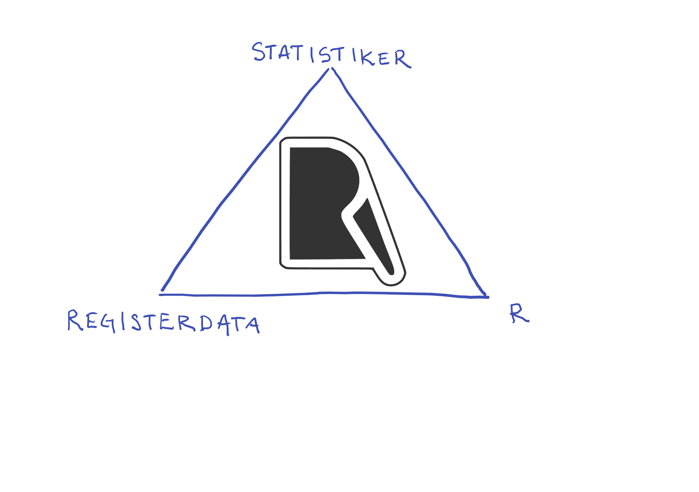
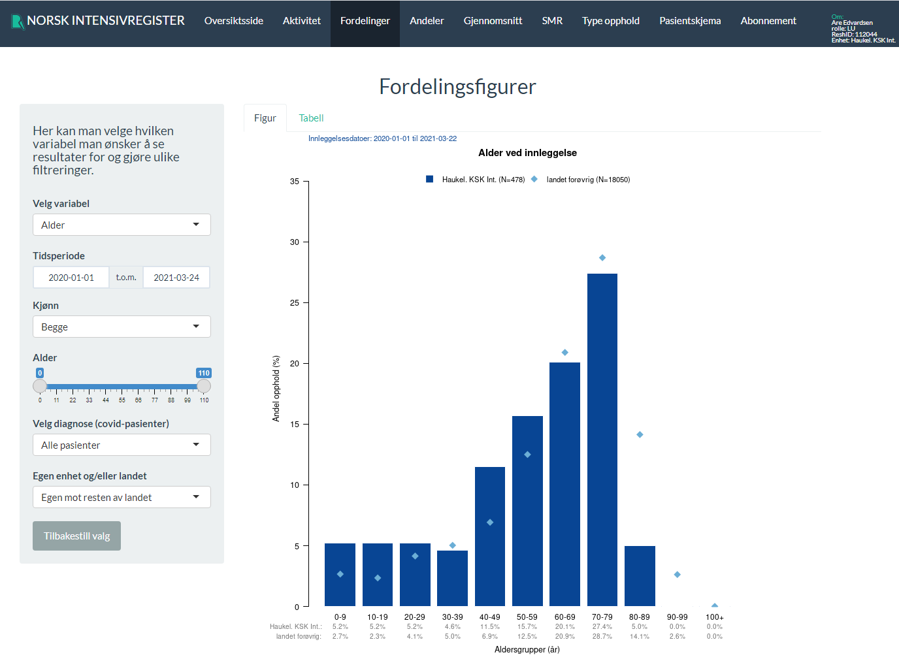
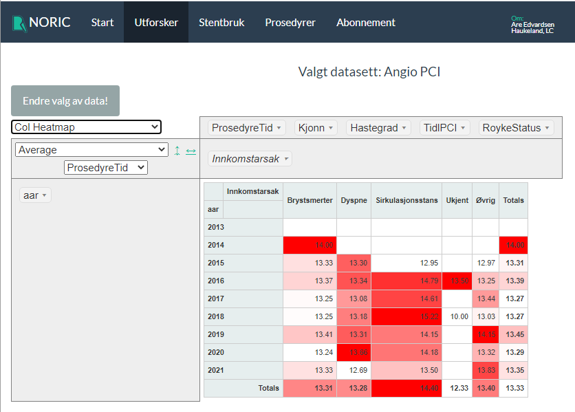
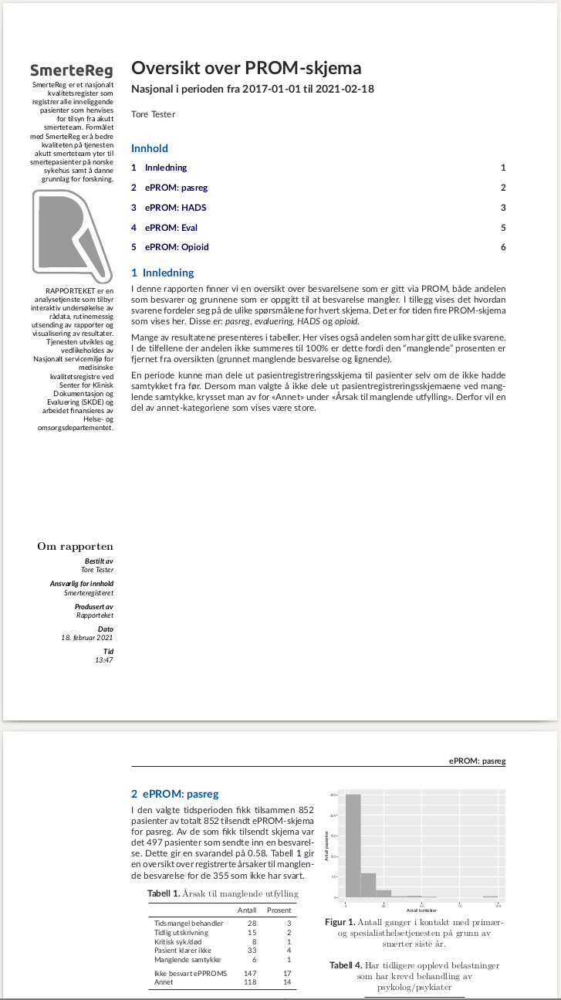

```{r, include = FALSE}
knitr::opts_chunk$set(
  collapse = TRUE,
  comment = "#>"
)
```

```{r setup}
library(rapporteket)
```

## Rapporteket er ikke en "teknisk løsning"


## Bruk

### Interaktivitet




### Utsendelser

