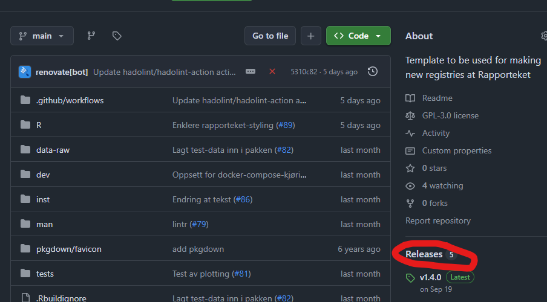
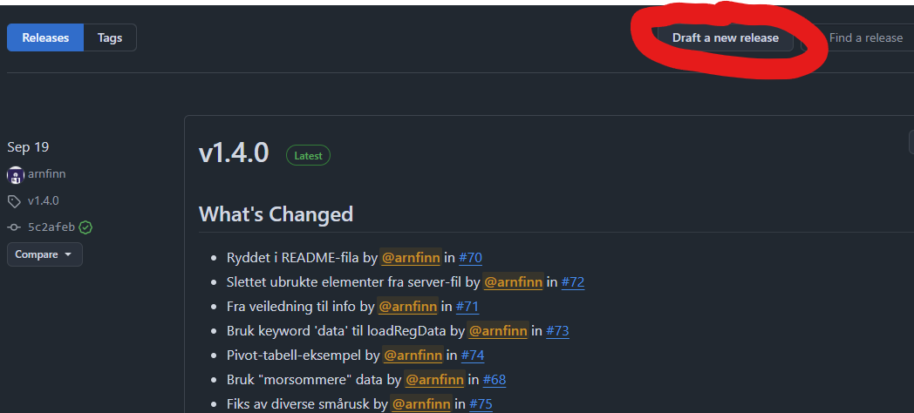
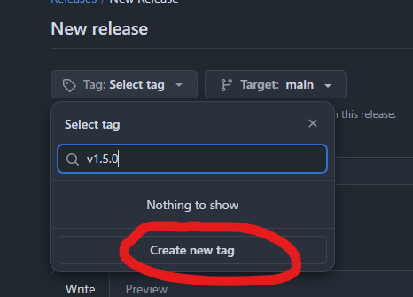
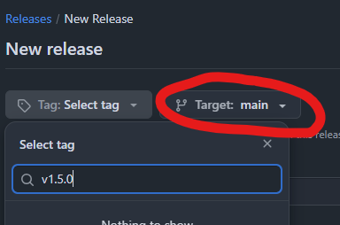
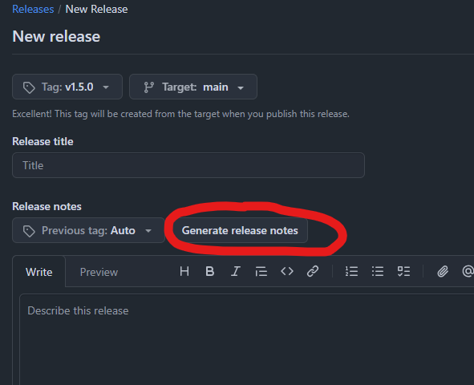
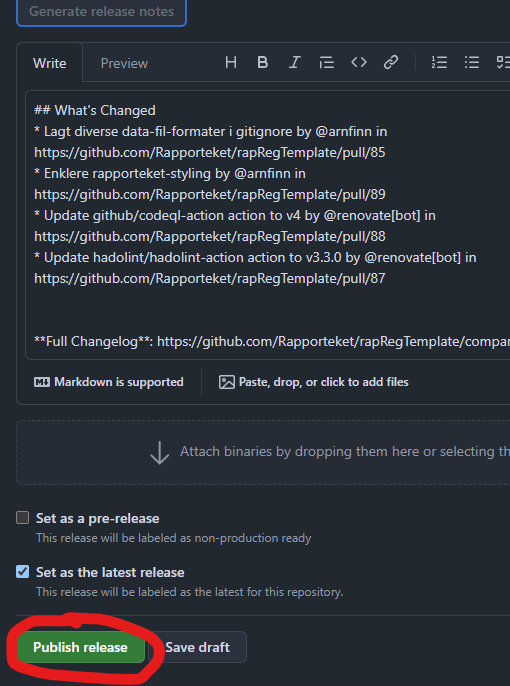

1. Lag en ny versjon på github.
   - Gå inn på *releases* på høyre side, som fører deg til github.com/Rapporteket/\<ditt rapportek\>/releases

     

   - Trykk på *Draft a new release* øverst til høyre, som fører deg til github.com/Rapporteket/\<ditt rapportek\>/releases/new

     

   - Trykk på *Choose a tag* og skriv inn neste versjonsnummer, f.eks. `v1.2.0` (vi bruker [semver](https://semver.org/) for hvordan vi setter versjonsnummer). Versjonsnummeret skal være hakket over forrige versjon, og det skal lages en ny tag (trykk på *Create new tag: v1.2.0 on publish*)

     

   - Sjekk at du har valgt riktig gren (f.eks. *Target: main*)

     

   - Trykk på *Generate release notes*.

     

   - Trykk på *Publish release*.

     

2. Vent til ny versjon er dyttet opp til Harbor. Sjekk status under github.com/Rapporteket/\<ditt rapportekt\>/actions.
3. Endre i fila `values-qa.yaml` på [helsegitlab](https://helsegitlab.nhn.no/). Vent noen minutt på at ny versjon dukker opp på [rapporteket.qa.nhn.no/app/\<ditt rapportekt\>](https://rapporteket.qa.nhn.no/).
4. **Sjekk applikasjonen nøye.**
5. Hvis alt er OK, opprett en *merge request* mot prod-grena ved å gjøre tilsvarende endring i `values-prod.yaml` som ble gjort i punkt 3.
