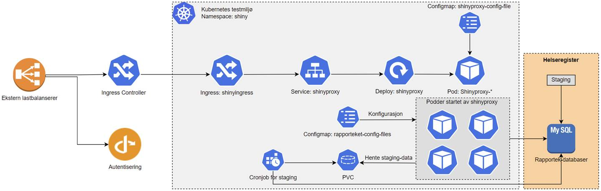

```{r, include = FALSE}
knitr::opts_chunk$set(
  collapse = TRUE,
  comment = "#>"
)
```


# Innledning

# Leveranser

I prosjektsøknaden ble gjennomføring av følgende oppgaver pekt på som sentrale for nå målet for prosjektet:

* utvikle og teste teknisk arkitektur,
* etablere og teste metoder for kontinuerlig integrasjon og leveranse (ci/cd),
* utvide ShinyProxy for integrasjon mot OpenID-tjenester som benytter PKCE-flyt, og
* teste Falk som identitetsleverandør til Rapporteket

Avsluttende status og resultater fra prosjektet er gitt under.

## Prosjektstatus ved avslutning
Leveranser til prosjektet har i kommet fra SKDE, Helse-Nord IKT og Norsk Helsenett og involverte personer er gitt i tabell \@ref(tab:pers).

```{r make table pers, results='asis', echo=FALSE}
tabData <- data.frame(
  SKDE =  c(
    "Are Edvardsen",
    "Arnfinn Hykkerud Steindal",
    "",
    "",
    "",
    "",
    "",
    "",
    ""
  ),
  HNIKT = c(
    "Sigurd Hansen",
    "Morten Engan",
    "",
    "",
    "",
    "",
    "",
    "",
    ""
  ),
  NHN = c(
    "Tove Sverkmo",
    "Kristian Nordtømme",
    "Borgar Føll Flytør",
    "Vegard Jørgensen",
    "Håvard Elnan",
    "Ida Hellsaa",
    "Håvard Wang",
    "Jon Ramy Andersen",
    "Kenneth Vanvik"
  )
)

cap <- paste(
  "Organisasjoner og personer som har deltatt aktivt i prosjektet.",
  "SKDE = Senter for klinisk dokumentasjon og evaluering, Helse Nord RHF,",
  "HNIKT = Helse Nord IKT HF, NHN = Norsk Helsenett"
)

rapbase::mst(tab = tabData, cap = cap, label = "pers", align = "lll",
             type = params$tableFormat)

```

I alt er prosjektet fakturert XX arbeidstimer og leie av infrastruktur og driftsmiljøfor til sammen kr YYY YYYY i all hovedsak fra aktivitet hos Norsk Helsenett (?). Det ble også levert et betydelig men ukjent antall selvfinansierte arbeidstimer fra SKDE og Helse Nord IKT. Ved prosjektslutt gjenstår det til sammen kr ZZ som i sin helhet tilbakeføres til Teknologiforum for medisinske kvalitetsregistre (FMK).

## Teknisk arkitektur
Utgangspunktet for oppsett av infrastruktur ble hentet fra forprosjektet og etablert i to utgaver: ett hos HNIKT for utprøving og justeringer gjennom prosjektet og ett hos NHN som et replikat av oppsettet hos HNIKT men med formål å representere et reelt driftsmiljø. Endelig oppsett hos NHN er vist i Figur \ref{fig:arch}.



> Teknisk arkitektur slik den er utarbeidet her er fremtidsrettet og i stand til å understøtte alle oppgaver knyttet til drift av Rapporteket. Med fremtidsrettet menes det at valgt løsningen har fokus på høy grad av automatisering og skalerbarhet knyttet til livssyklus og bruk av relevante applikasjoner. Prosjektet har gjennom fullskala testing demonstrert at valgt arkitektur understøtter alle kjente oppgaver for applikasjonere som skal kjøre på Rapporteket. 

\begin{figure}[H]
\includegraphics[width=0.95\textwidth, height=!]{/home/rstudio/rapporteket/inst/fmk_container/arch.png}
\centering
\caption{Systembeskrivelse av driftsmiljø for Rapporteket hos Norsk Helsenett.}
\label{fig:arch}
\end{figure}


## Kontinuerlig integrasjon og leveranse
Et viktig mål i prosjektet har vært å identifisere og prøve ut tiltak for økt effektivitet og kvalitet i forbindelse med endring i programvare (applikasjoner på Rapporteket) og dritssetting. Ved sammenkobling av systemer (integrasjon) og automatisering av prosesser kan takten for oppgradering av programvare økes samtidig som sannsynligheten for feil reduseres. En av hovedutfordringene her er at ansvaret for utvikling og drift av programvare tilhører ulike organisasjoner.


# Anbefalinger
