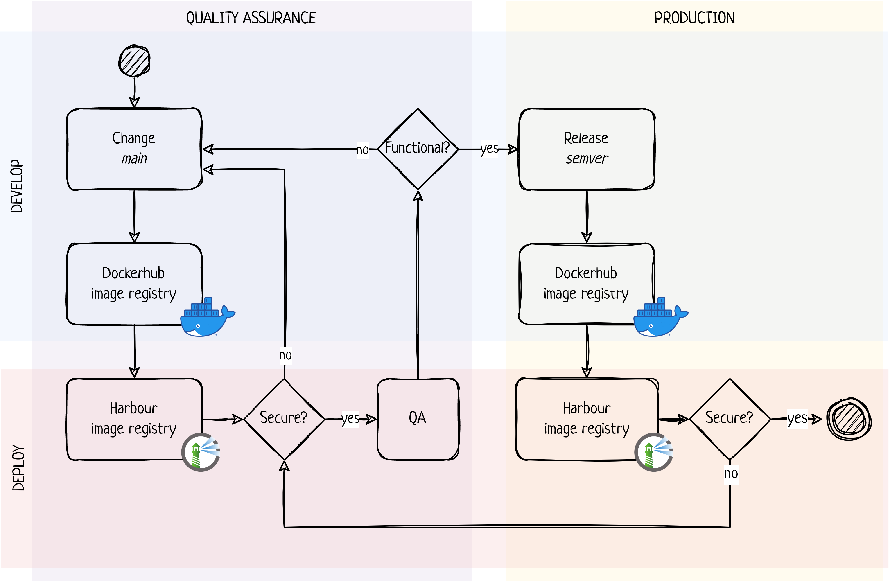

```{r, include = FALSE}
knitr::opts_chunk$set(
  collapse = TRUE,
  comment = "#>"
)
```


# Innledning

# Leveranser

I prosjektsøknaden ble gjennomføring av følgende oppgaver pekt på som sentrale for nå målet for prosjektet:

* utvikle og teste teknisk arkitektur,
* teste og etablere metoder for kontinuerlig integrasjon og leveranse (ci/cd),
* utvide ShinyProxy for integrasjon mot OpenID-tjenester som benytter PKCE-flyt, og
* teste Falk som identitetsleverandør til Rapporteket

Avsluttende status og resultater fra prosjektet er gitt under.

## Prosjektstatus ved avslutning
Leveranser til prosjektet har i kommet fra SKDE, Helse-Nord IKT og Norsk Helsenett og involverte personer er gitt i tabell \@ref(tab:pers).

```{r make table pers, results='asis', echo=FALSE}
tabData <- data.frame(
  SKDE =  c(
    "Are Edvardsen",
    "Arnfinn Hykkerud Steindal",
    "",
    "",
    "",
    "",
    "",
    "",
    ""
  ),
  HNIKT = c(
    "Sigurd Hansen",
    "Morten Engan",
    "",
    "",
    "",
    "",
    "",
    "",
    ""
  ),
  NHN = c(
    "Tove Sverkmo",
    "Kristian Nordtømme",
    "Borgar Føll Flytør",
    "Vegard Jørgensen",
    "Håvard Elnan",
    "Ida Hellsaa",
    "Håvard Wang",
    "Jon Ramy Andersen",
    "Kenneth Vanvik"
  )
)

cap <- paste(
  "Organisasjoner og personer som har deltatt aktivt i prosjektet.",
  "SKDE = Senter for klinisk dokumentasjon og evaluering, Helse Nord RHF,",
  "HNIKT = Helse Nord IKT HF, NHN = Norsk Helsenett"
)

rapbase::mst(tab = tabData, cap = cap, label = "pers", align = "lll",
             type = params$tableFormat)

```

I alt er prosjektet fakturert XX arbeidstimer og leie av infrastruktur og driftsmiljøfor til sammen kr YYY YYYY i all hovedsak fra aktivitet hos Norsk Helsenett (?). Det ble også levert et betydelig men ukjent antall selvfinansierte arbeidstimer fra SKDE og Helse Nord IKT. Ved prosjektslutt gjenstår det til sammen kr ZZ som i sin helhet tilbakeføres til Teknologiforum for medisinske kvalitetsregistre (FMK).

## Teknisk arkitektur
Utgangspunktet for oppsett av infrastruktur ble hentet fra forprosjektet og etablert i to utgaver: ett hos HNIKT for utprøving og justeringer gjennom prosjektet og ett hos NHN som et replikat av oppsettet hos HNIKT men med formål å representere et reelt driftsmiljø. Endelig oppsett hos NHN er vist i Figur \ref{fig:arch}.


> Teknisk arkitektur slik den er utarbeidet her er fremtidsrettet og i stand til å understøtte alle oppgaver knyttet til drift av Rapporteket. Med fremtidsrettet menes det at valgt løsningen har fokus på høy grad av automatisering og skalerbarhet knyttet til livssyklus og bruk av relevante applikasjoner. Prosjektet har gjennom fullskala testing demonstrert at valgt arkitektur understøtter alle kjente oppgaver for applikasjonere som skal kjøre på Rapporteket. 

<!--- to be used for final doc 
\begin{figure}[H]
\includegraphics[width=0.95\textwidth, height=!]{/home/rstudio/rapporteket/inst/fmk_container/arch.png}
\centering
\caption{Systembeskrivelse av driftsmiljø for Rapporteket hos Norsk Helsenett.}
\label{fig:arch}
\end{figure}
-->


## Kontinuerlig integrasjon og leveranse
Et viktig mål i prosjektet har vært å identifisere og prøve ut tiltak for økt effektivitet og kvalitet i forbindelse med endring i programvare (applikasjoner på Rapporteket) og dritssetting. Ved sammenkobling av systemer (integrasjon) og automatisering av prosesser kan takten for oppgradering av programvare økes samtidig som sannsynligheten for feil reduseres. En av hovedutfordringene for en sammenhengende kjede er at ansvaret for utvikling og drift av programvare tilhører ulike organisasjoner. Løsningen er i hovedsak basert på enkle mekanismer og så få og enkle grenseflater som mulig.

På utviklersiden (registrene) er det etablert en metodikk som inneholder en rekke prosesser for å evaluere kodekvalitet, enhetstesting, samsvars- og sårbarhetsgrad samt bygg av applikasjon og tilhørende container image. Alle prosessene er automatiserte og kjører hver gang endringer foreslås. De ulike prosessene er satt sammen til en kjede som vil bli brutt i tilfeller hvor én eller flere obligatoriske tester feiler. Sluttproduktet er et container image plassert i et sentralt register. Ikke-automatiserte oppgaver i denne forbindelsen består i hovedsak av makkergjennomgang av kode og merking av produksjonsklare utgaver av applikasjonene.


Hos driftsorganisasjonen er det satt opp et internt image register som rutinemessig henter nye utgaver av container applikasjonen for Rapporteket fra det sentrale registeret. Nye image går deretter gjennom en evaluering av sårbarhet, og om denne er tilstrekkelig lav så driftssettes containerapplikasjonen i et QA-miljø. Image for container applikasjoner som allerede er godkjent gjennom tidligere QA-prosess merkes spesielt og driftssettes deretter i et produksjonsmiljø. Alle image i internt register evalueres også ved faste intervaller for å identifisere eventuelt nye sårbarheter i image som er i aktiv bruk av allerede driftssatte applikasjoner.



> Prosjektet har etablert en sammenhengende kjede for kontinuerlig integrasjon og leveranse av container applikasjoner for Rapporteket. Gjennom et minimum av grenseflater og forenklede tilbakemeldingsmekanismer mellom deltagende organisasjoner er det demonstrert en fungerende og i stor grad automatisert prosess for driftssetting av en Rapporteket applikasjon i full skala. 

## ShinyProxy og OpenID med PKCE-flyt
ShinyProxy er en mellomtjener basert på [Spring boot](https://spring.io/projects/spring-boot) spesialtilpasset for bruk sammen med R-Shiny applikasjoner som Rapporteket er bygd opp av. Denne mellomvaren har en rekke viktige egenskaper som er relevant for Rapporteket, blant annet

- skalering til 1000vis av brukere av R-shiny applikasjoner,
- autentisering og autorisasjon gjennom innebygget integrasjon mot en rekke standard metoder, og
- mulighet for gjenbruk av identitet og autorisasjon (single-sign on)

Et av målene i prosjektet var bruk av [Falk](https://falk.hemit.org/) som ny tjeneste for innlogging til Rapporteket og et av kravene for bruk av Falk var autentisering basert på OpenID med PKCE utvidelse. ShinyProxy hadde ved prosjektoppstart støtte for OpenID, men ikke med PKCE. Helse Nord IKT etablerte en lokal utvidelse av koden til ShinyProxy og patchet utgave med PKCE-støtte ble brukt videre i arbeidet. Samme kodeutvidelse ble også gitt til [Open Analytics](https://www.openanalytics.eu) med forespørsel om innarbeiding i fremtidige offisielle versjoner av ShinyProxy og denne enringen vil være med fra og med versjon 3.0.0 av ShinyProxy. I følge [Open Analytics](https://www.openanalytics.eu) vil denne versjonen slippes i slutte av februar 2023.

> Siden Rappoteket er basert på R-Shiny applikasjoner og at fremtidig driftsform vil være container basert så er ShinyProxy som mellomtjener en sentral komponent som blant annet ivaretar god skalering og integrasjon mot eksterne autentisering- og autorisasjonstjenester. Prosjeket har demonstrert at bruken av ShinyProxy fungere etter hensikten i den arkitekturen som er etablert for driftsmiljøet. Videre demonstreres nytten av åpen kildekode for å kunne gjøre egne tilpassinger og å kunne bidra til at slike tilpassinger også kan komme andre til gode.

## Biprodukter fra prosjektet

- rapbase
- sship
- base-r


# Anbefalinger

Før flytting:
- forhåndsgodkjent change hos nhn
- etablering av egen kanal for utveksling av info ifm ci/cd
- driftsleverandør inn i forvaltningsgruppe
- forvaltningsgruppen ansvarlig for ci/cd
- grupper i Falk
- 

Videre forbedring:
- tilknyttet utv miljø for Rapporteket hos driftsleverandør -> tilgang til data er viktig
